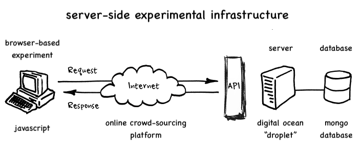

## Web-based experimental ecosystems

Psychologists and cognitive neuroscientists increasingly rely on web-based crowdsourcing platforms (e.g. Amazon Mechanical Turk) to perform human behavioral experiments. This repository serves a tutorial for designing customizable client- and server-side operations within a single, web-based experimental ecosystem. 

### A experiment-oriented introduction to server-side programming

Typically, researchers design browser-based (i.e. client-side) experiments and outsource the necessary online (i.e. server-side) infrastructure to third parties. These generic, server-side resources are suitable for certain use cases, and are attractive because of their ease of adoption. But they impose numerous limitations on the design and management of experiments---for researchers as well as participants. 

Designing the server-side instrastructure in tandem with client-side experiments offers a powerful alternative: It provides an integrated framework for experimental design, data collection, and data managment. Unfortunately, this approach can seem prohibitive, given the expertice required to adapt these tools for experiment-centered programming.

This repository offers a step-by-step tutorial for using these server side tools within web-based experiments: building your own server, formatting and storing experimental data, and then retrieving these data for further analysis. No previous knowledge of server-side programmeing required.

### Outline of server-side infrastructure: 

We use open source programming tools that are standard within the web development community, as well as responsible compute resource: 

- **`node.js`**: experimental "backend," manages client-server interactions 
- **`mongodb`**: NoSQL database for data storage and management
- **`digital ocean "droplet"`**: cloud computing resource to run experiments, collect and store data   

### An extensible use case: experimental access to a server side database

We focus on a single use case: reading and writing to a server side database during an experiment. We accomplish this through a database query that enables us to determine whether that participant has previously participated in this study. Then, we save trial-by-trial data to the sever throughout the experiment. These operations should be useful for the most common experiments, and provide a foundation for extending these tools out into more interesting use cases. 

### Getting started :egg::hatching_chick::hatched_chick:

In `server_setup/` we walk through how to set up a server, with the necessary security protocols and Domain Name dependencies; for those who are new to these tools, we have done our best to remove _any ambiguity_ over each decision point, but please let us know if we've missed something. Once your server is up and running, the scripts in `experiment_setup/` illustrate how you might integrate these server-side tools into any javascript-based experiments you already have: 

- `hello_world/` walks through each line of code you need to understand to the basics of client-server interactions using a minimal test case: reading and writing to a server with a client-side interface. 
- `jsPsych_demo/` illustrates the simplest experimental use case---saving trial-by-trial data onto a sever---using a popular javascript-based experimental programming framework ([jsPsych](https://github.com/jspsych/jsPsych)).
- `mturk_demo` integrates the read-write functionality from `hellow_world` within the`jsPsych_demo` framework in redirect experimental participants that have completed your task multiple times.

These examples are designed with both pedigogy and practicality in mind. Hopefully, working this will provide an extensible framework for your own experimental and scientific needs :) 

