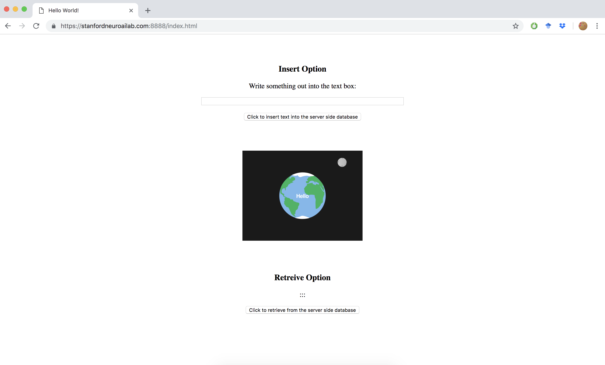

# A 'Hello World!' example in node

This is a bare bones example that utilizes all of the server side infrastructure we've been developing. It's a good place to start if you need to troubleshoot your setup or try to understand what's going on under the hood. Generally: 

- `index.html`: the 'landing page' served to the client, with instructions for the server
- `app.js`: mangages server-client interactions, and server-server interactions (e.g. mongo queries)
- `functions.js`: client side functions that link html elements (e.g. buttons) with server side processes

You'll need to create a folder in this directory called `credentials` that has three json files you've created throughout the set up process: 

- `mongo_keys`: contains the user and password you set to secure mongodb 
- `ssl_certificate`: the ssl certificate you generated to enable https 
- `ssl_privatekey`: the ssl private key you generated to enable https 

You'll also need to make sure you have `port 8888` enabled in your firewall. 

Once you have these requirements met, initialize the `node` modules in this folder with `npm`:

```  
user@server$ npm init --yes # initialize and accept all defaults
```

Install the modules we'll need: 

```
$ npm install express mongodb assert https socket.io 
```

This will create a folder `node_modules` in this directory as well as `package.json` and `package-lock.json` files. Check them out when you have time. 

Run the main node executable, (which we've named following the standard convention): : 

```
$ node app.js
```

You should see the following line printed on the console: `Example app listening on port 8888`. Server side events will be printed out here. 

Enter the following in your browser:

```
https://<your_domain_name>:<port_number>:/index.html
```

where `<your_domain_name>` is the full domain name you purchased (with the extension, e.g. cutename.com) and `<port_number>` is `8888`. 

In your browser, you should be able to enter text onto the server, then extract random entries: 




If you open the inspector in your browser (e.g. [Firefox](https://developers.google.com/web/tools/chrome-devtools/console/) or [Chrome](https://developers.google.com/web/tools/chrome-devtools/console/) you can see the client side operations printed out in the console.


### tmp notes
For the moment I've disabled the mongo authentification process (ERR otherwise). To revert back to a more secure mongo protocol, uncomment these lines in `/etc/mongo.conf`

```
29 #security:
30 #  authorization: "enabled"
```

and restart the database with 

```
$ sudo systemctl restart mongod
```
