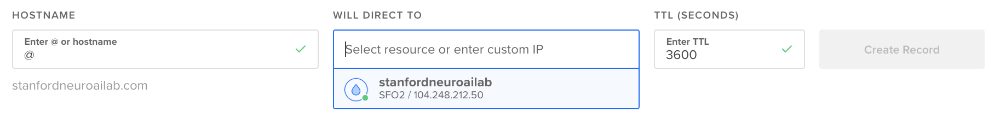

# Compatibility with online crowdsourcing tools

Our lab uses **`Amazon Mechanical Turk`** ("mturk") for crowdsourcing our experiments online. In order to make our server-side infrastructure compatibile with mturk, we have to enable [https](https://https.cio.gov/faq/) encryption between our servers and third parties. We'll do this in two steps. First, we need to set up a domain name. Second, we need to set up a [SSL Certificate](https://www.globalsign.com/en/ssl-information-center/what-is-an-ssl-certificate/) for our server. This is all to protect the privacy of people who are participating in our studies. 

### Step 1.1: Get a domain name

A domain name is just a human readable pointer to some location on the internet. For example, `google.com` is a more legible version of it's Internet Protocol (IP) address, `172.217.6.206`, but a web browser understands them both just fine. Your droplet already has an IP address. So you just need to find a domain name and then route visitors from that domain name to your server, like google does. 

We've used [namecheap](https://www.namecheap.com/), but you can use whatever providor you like--[freenom](https://www.freenom.com/en/index.html) is free, but we haven't tested it. 

### Step 1.2: Routing domain names to IP addresses

DNS (**`Domain Name System`**) is a naming system that maps a server's domain name, like `google.com`, to an IP address, like `172.217.6.206`. **`Registrars`** are organizations that have completed some accreditation process that allows them to sell domain names (e.g. Namecheap). Once you've purchased a domain name, you can manage your DNS records with other providers (e.g. digital ocean). 

In order to manage your DNS records with digital ocean, first you need to tell your registrar that Digital Ocean is actually going to be managing things. To do this, you need to direct [your Registrar to Digital Ocean's Nameservers](https://www.digitalocean.com/community/tutorials/how-to-point-to-digitalocean-nameservers-from-common-domain-registrars):

- ns1.digitalocean.com
- ns2.digitalocean.com
- ns3.digitalocean.com

### Step 1.3: Configuring your Digital Ocean droplet

[Add your domain name to your droplet](https://www.digitalocean.com/docs/networking/dns/how-to/add-domains/) so that you can manage you DNS records on Digital Ocean. Once you've done this, [set an A record](https://www.digitalocean.com/docs/networking/dns/how-to/manage-records/) using DigitalOcean DNS. If you only have one domain name configured, just set the host name with an '@', like this: 

Once you've made these updates, it make take a minute for everything to register. Before moving on, check to make sure this worked. You'll be able to ssh into your droplet using the domain name; where you had to type in something like this before (and this still works): 
	
	ssh root@104.248.212.50
	
now you'll be able to do it like this: 
	
	ssh root@stanfordneuroailab.com	

Now that you're here, you should add a non-root user and configure apache on the server, in that order: 

1. instructions for setting up a non-root [user](https://www.digitalocean.com/community/tutorials/initial-server-setup-with-ubuntu-16-04)
2. instructions for [configuring apache](https://www.digitalocean.com/community/tutorials/how-to-set-up-apache-virtual-hosts-on-ubuntu-16-04)

. . .

### Step 2: getting an SSL certificate

Setting up a SSL certificate is straightforward through the [command line on your droplet](https://www.digitalocean.com/community/tutorials/how-to-secure-apache-with-let-s-encrypt-on-ubuntu-18-04), logged in as a non-root sudo user. 

### Step 3: configuring your server's firewall 

In order to use ... Set up [apache](https://www.digitalocean.com/community/tutorials/how-to-install-the-apache-web-server-on-ubuntu-18-04)

